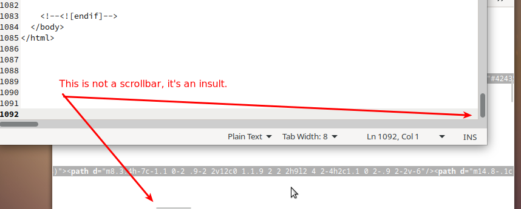
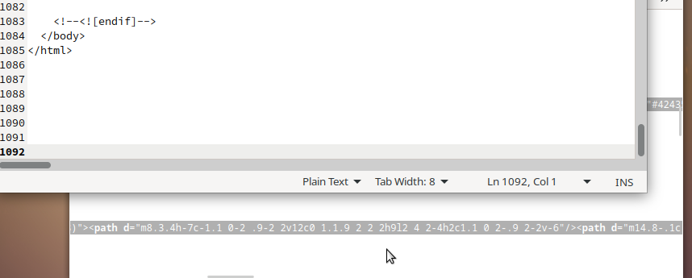
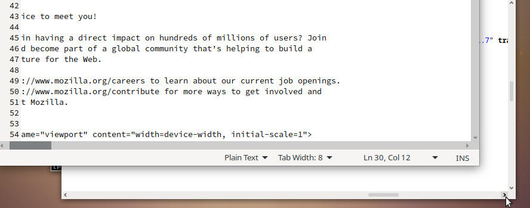

Fix broken GTK scrollbars
=========================

This script tries to fix your scrollbars.

Someone broke all the scrollbars in GTK/Gnome/Mate:
No more arrow buttons, it's impossible to carefully scroll through a huge
document, read very long lines.
Whoever broke that basic gui feature - someone should take his computer away.
And since Mozilla has stopped improving their browser years ago
and instead, they are now increasing the major version with every
new useless button, even more unwanted "news" and other ad-ware,
they had no way but to add a Firefox setting to break their scrollbars too.
Sometimes, I wish these people who keep breaking and removing features
were forced to actually use their software for work.

This is not just a bug, it's more like a transhuman robot with a
smartphone for a head, which is too smart for scrollbars so it had to kill them.

Before:

After:

It can happen if you switch to another theme!
(Appearance Preferences > Customize Theme > "Industrial")
In the 21st century, switching themes can break scrollbars.
So you should run this script again after changing the theme.

And keep in mind that different applications are affected in different ways,
depending on the GTK version and if they're made by Mozilla.

* leafpad (text editor) uses GTK 2.0. Other applications using GTK2 should also be fixed by this script.
* gedit (text editor) uses GTK 3.0. Other applications using GTK3 should also be fixed by this script.
* Firefox ... it's Firefox, so it's special. Fixes version 105 (lol). But who knows, maybe they'll remove the scroll feature althogether soon, after all, if a page is too long to fit in the window, modern users may not have the attention span necessary to read it all anyway.

